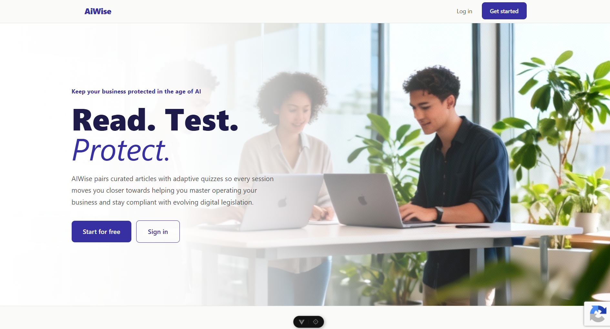
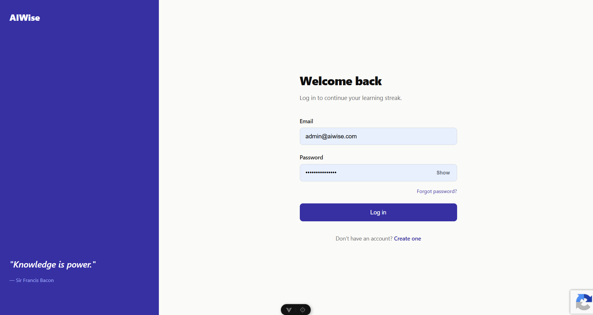
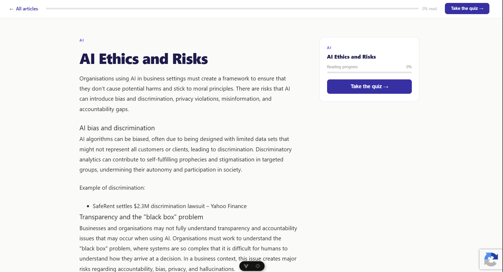
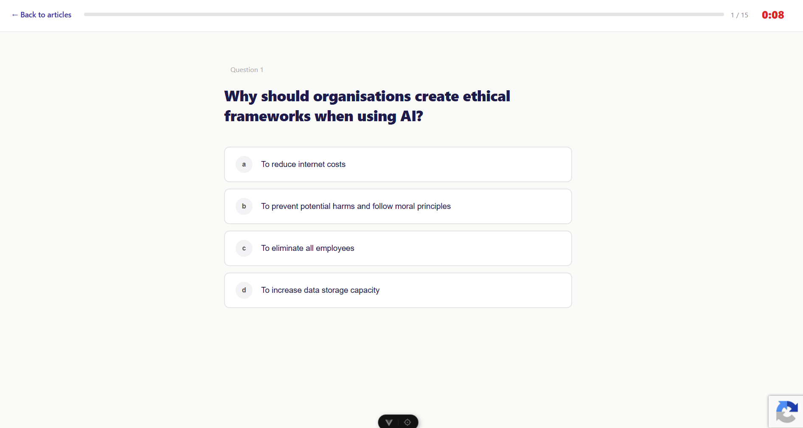
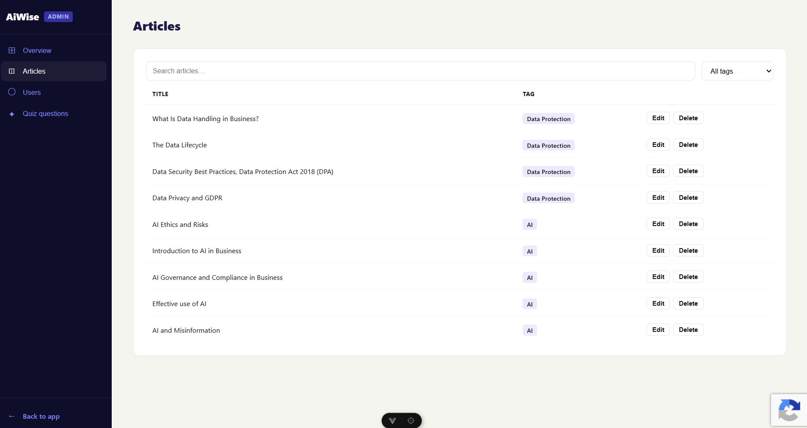

# AIWise Project

AIWise is a full-stack web application designed to help users understand
data protection, artificial intelligence, and evolving digital legislation
through curated educational articles and interactive quizzes.

The project was developed as a full-stack portfolio project using Vue.js,
Flask and PostgreSQL.

## Live Demo

[Live application link to youtube will go here after deployment]

## Features

### User Features
- User registration and login
- Secure password authentication
- Email verification
- Password reset functionality
- User profile management
- Account deletion
- Educational article library
- Article search and filtering
- Interactive quizzes
- Quiz result tracking
- User dashboard

### Administrator Features
- Role-based administrator access
- Administrator dashboard
- View registered users
- View recently registered users
- Ban users
- Manage articles
- Manage quiz questions
- View application statistics

### Security
- Password hashing
- Session-based authentication
- Role-based access control
- Rate limiting
- Google reCAPTCHA
- Secure cookie configuration
- Email verification
- HTTP security headers using Flask-Talisman
- Environment variables used for sensitive configuration

## Technology Stack

### Frontend
- Vue 3
- TypeScript
- Vite
- Vue Router
- Axios
- HTML
- CSS

### Backend
- Python
- Flask
- Flask-Mail
- Flask-Limiter
- Flask-Talisman
- Flask-CORS

### Database
- PostgreSQL

### Testing
- pytest
- Vitest
- Vue Test Utils
- Manual functional testing

## Architecture

AIWise uses a client-server architecture.

Vue provides the frontend user interface and communicates with a Flask
REST API using Axios. Flask handles authentication, application logic and
database operations, with PostgreSQL providing persistent data storage.

Frontend (Vue)
        |
      Axios
        |
        v
Flask REST API
        |
        v
PostgreSQL

## Testing

AIWise was tested using both manual and automated testing.

Backend API routes and application logic were tested using pytest,
including authentication, authorization and error handling.

Frontend components and user interactions were tested using Vitest and
Vue Test Utils.

Manual end-to-end testing was also performed across core user journeys
including registration, login, article reading, quiz completion, account
management and administrator functionality.

## Running Locally

### Requirements

- Python
- Node.js
- PostgreSQL
- npm

### Backend

Clone the repository:

    git clone <repository-url>

Navigate to the backend:

    cd backend

Install Python dependencies:

    pip install -r requirements.txt

Create a `.env` file containing the required environment variables.

Do not commit the `.env` file to source control.

Start Flask:

    python app.py

### Frontend

Navigate to the frontend:

    cd frontend

Install dependencies:

    npm install

Start Vite:

    npm run dev

## Environment Variables

The application requires environment variables for configuration and
sensitive credentials.

The backend environment template is available at `backend/src/.env.example`.
Copy it to `backend/src/.env` and replace the placeholder values with your
local credentials. Do not commit real secrets.

## Deployment

Deployment information will be added once the production version of
AIWise is available.

## Future Improvements

Potential future improvements include:

- Expanded article and quiz content
- More detailed learning analytics
- Improved automated test coverage
- Additional administrator reporting
- Enhanced accessibility
- Responsive/mobile improvements

## Screenshots

## Author

Ruby Wharton

Full-stack portfolio project developed for graduate software engineering
opportunities.
